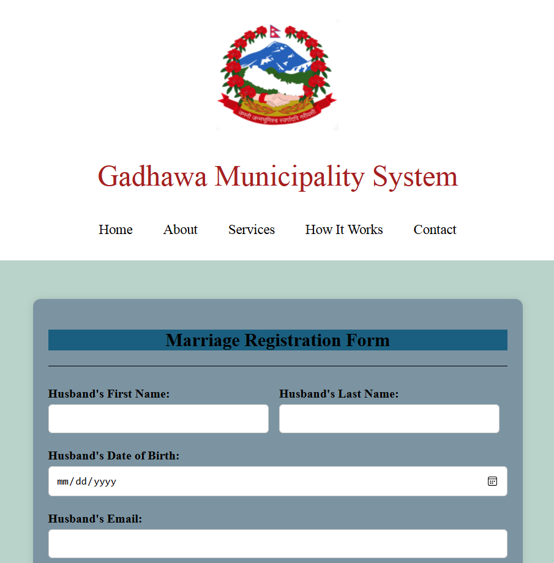
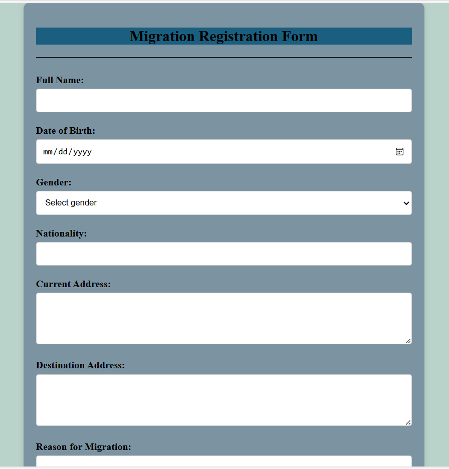

# 📝 Registration System
This is a simple web-based registration system built with HTML, PHP, and MySQL. It includes forms for **Marriage Registration** and **Migration Registration**, and stores the data in a structured MySQL database.

## 📂 Features
- Marriage Registration Form
- Migration Registration Form
- Data stored securely in MySQL database
- Search functionality to find submitted records
- Basic validation and file structure

## 🛠 Technologies Used
- HTML, CSS, Javascript
- PHP
- MySQL

  
  

